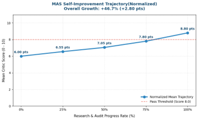
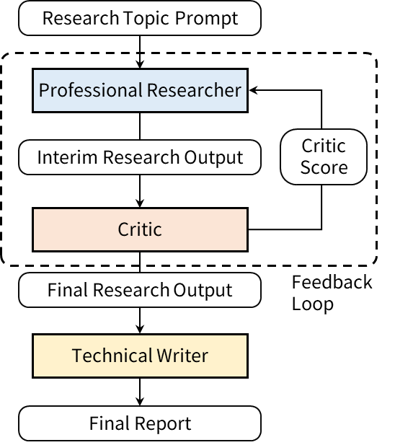

# Self-Improving Multi-Agent Research System (MAS vs. Baseline Benchmark)

> An autonomous, self-improving research framework built with **LangGraph** and the **Google Gemini API**. By leveraging automated feedback loops and Pydantic-based structured evaluations, the system autonomously audits and refines large language model (LLM) research outputs with minimal human intervention.

---

## 1. Executive Summary

This project evaluates the performance of a **Multi-Agent System (MAS)** against a **Single-Pass Baseline** across complex technical, regulatory, and industrial research topics. By decoupling research generation from quality auditing, the system achieves significant improvements in factual accuracy, source grounding, temporal validity, and comprehensive coverage.

* **Core Frameworks**: LangGraph, LangChain, Google Gemini API (`gemini-flash-latest`), Tavily Web Search API
* **Key Capabilities**:
  * Automated quality auditing using Pydantic-driven **Structured Output** schemas (`QualificationScore`, `ReportMetricScore`)
  * Dynamic **Critic-Researcher feedback loops** that extract missing context and auto-generate targeted re-search queries
  * Mathematical evaluation via time-normalized linear interpolation on tracked `score_history`
  * Automated batch execution, Markdown report exports, and visualization pipelines (Matplotlib & `python-pptx`)

---

## 2. Background & Motivation

### 2.1. Limitations of Single-Agent Architectures
* **Hallucinations & Unverified Claims**: Standard single-pass search agents often generate unverified statements or fail to attach precise inline markdown source URLs.
* **Temporal Discrepancies**: Single agents frequently confuse speculative future estimates with historical facts.
* **Lack of Self-Correction**: Single agents cannot independently audit their outputs to identify missing subtopics or structural gaps.

### 2.2. The Multi-Agent Advantage
* **Decoupled Quality Auditing**: Separating the research generation role (**Researcher**) from the quality assurance role (**Critic**) enforces strict verification standards.
* **Iterative Self-Improvement**: Automated feedback loops ensure research reports are iteratively refined until meeting a strict quality threshold (Critic Score ≥ 8/10).

---

## 3. System Methodology

### 3.1. Agent Architecture & Node Roles

The system architecture comprises three specialized nodes interacting within a stateful graph:

```text
[START] ──> Senior Researcher ──> Quality Critic ──(Score < 8)──> [Feedback Loop (Re-Search)]
                                      │
                                (Score >= 8)
                                      │
                                      ▼
                               Technical Writer ──> [Export .md] ──> [END]
```

* **Senior Researcher Node**:
  * Executes web searches via Tavily based on initial queries or refined '[CRITIC_FEEDBACK]' from the Critic.
  * Synthesizes newly retrieved facts and verified URLs into past research frameworks.
* **Quality Critic Node**:
  * Evaluates synthesized research against three strict criteria using Pydantic structure ('QualificationScore'): Accuracy & Grounding (40%), Temporal Accuracy (30%), and Data Sufficiency (30%).
  * Outputs an integer score (0–10) and structured feedback ('[CRITIC_FEEDBACK]') if the score is below 8.
* **Technical Writer Node**:
  * Compiles the final, verified research into a clean Markdown document.
  * Operates in MAS mode to output structured ReportMetricScore objects ('Reliability Index' & 'Iterative Improvement Index'), updating AgentState.

### 3.2. Experimental Design (Benchmark Setup)
1. Benchmark Topics ('research-topics.txt'): 10 high-complexity topics covering A2A vs. MCP protocols, HBM3e/HBM4 packaging roadmaps, EU AI Act vs. US EO 14110 compliance timelines, Level 3/4 autonomous driving commercialization, and SMR economics.
2. **Comparative Control Groups**:
   * **Baseline**: `Researcher ➔ Writer` (Single-pass generation without feedback loops)
   * **MAS**: `Researcher ➔ Critic ➔ (Loop) ➔ Writer` (Iterative feedback-driven refinement)

---

## 📊 4. Results & Evaluation

### 4.1. Quantitative Performance Improvement

* **Overall Reliability Gain**:
  * The Multi-Agent System achieved a statistically significant increase in mean Critic Scores compared to the Single-Pass Baseline across all 10 benchmark topics.

<p align="center">
  
</p>

*(Description: Bar chart illustrating the average Critic Score and percentage reliability gain of MAS over Baseline)*

* **Iterative Score Progression**:
  * Initial research outputs scoring between 4–6 points due to missing URLs or missing subtopics consistently improved to **8–10 points** after 1–3 feedback iterations.
  * Research outputs starting at an initial mean score of ~6.00 points consistently converged to 8.80+ points upon completion.

[Graph 1: Reliability Growth Trend across Feedback Iterations]
*(Description: Line graph illustrating normalized mean score growth and convergence across research completion stages)*

### 4.2. Architecture Diagrams & Visualizations

<p align="center">
  
</p>

*(Description: Multi-Agent System Web Research System with feedback loops)*

---

## 📁 5. Repository Structure

```text
.
├── topics.txt                        # Benchmark research topics (10 complex queries)
├── mas-research-project.ipynb               # Execution notebook & control loops
└── README.md                         # Project documentation